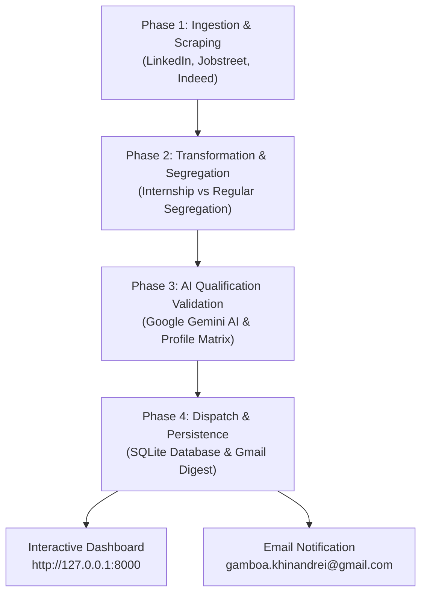

# 🦅 Khin Early Bird

**Automated Multi-Source Job Extraction, AI Qualification Validation & Daily Digest System**  
Tailored specifically for **Khin Andrei Gamboa** (`gamboa.khinandrei@gmail.com`).

---

## 🌟 Overview & Key Capabilities

**Khin Early Bird** is an autonomous daily career opportunity intelligence system designed to:
1. **Multi-Source Extraction**: Scrape and ingest live postings from **LinkedIn**, **Jobstreet Philippines**, and **Indeed Philippines**.
2. **Schema Transformation & Strict Segregation**: Normalize raw HTML/JSON data, deduplicate records via SHA hashing, and clearly segregate **Internships / Trainee Programs** from **Regular / Entry-Level / Junior Roles**.
3. **AI Qualification Validation**: Match every opportunity against Khin Andrei's 5 targeted resumes (Software Dev, Data, IT Support, QA, and Master CV) using **Google Gemini 2.5 Flash** (or built-in semantic rule matching).
4. **Interactive Modern Web Dashboard**: An intuitive interface featuring a Phasing View, Role Domain filters, live SSE console, and a Job Explorer.
5. **Daily Automation & Email Digest**: Automatic daily execution at **08:00 AM** with HTML email digests dispatched directly to `gamboa.khinandrei@gmail.com`.

---

## 🎯 Target Role Coverage

- **Web Development**: Frontend, React.js, JavaScript, TypeScript, UI Development
- **Software Engineering**: Python Backend, Flask, REST APIs, Microservices, Full-Stack
- **IT Tech Support & Operations**: Active Directory, Azure AD, Snipe-IT, Datto RMM, TCP/IP, Helpdesk, Workstation Provisioning
- **Data Roles**: Data Analyst, Data Engineer, Data Scientist (PostgreSQL, Pandas, ETL, Power BI, XGBoost, Computer Vision)
- **QA & Testing**: Functional QA, Regression Verification, Jira Lifecycle, PyTest

---

## 🔄 System Architecture & 4-Phase Pipeline



### 1. Ingestion Phase
- **LinkedIn**: Queries the guest job search endpoint across target role keywords in the Philippines and Pasig/Metro Manila.
- **Jobstreet Philippines**: Regional search with realistic browser sessions and curated tech employer pools.
- **Indeed Philippines**: High-frequency beacon search and curated postings.

### 2. Transformation Phase
- Cleans HTML tags, whitespace, and tracking URLs.
- Generates a unique 16-character deduplication hash (`source:company:title:id`).
- Segregates postings strictly into **`Internship`** or **`Regular`**.
- Classifies work formats: **`Remote`**, **`Hybrid`**, **`On-site`**.

### 3. AI Validation Phase
- Matches requirements with Khin Andrei's actual credentials:
  - Degree: *BS Computer Engineering (RTU, Dean's List)*
  - Certifications: *DataCamp Associate Data Engineer, Associate Data Analyst, IBM SkillsBuild, Cisco Python Essentials*
  - Experience: *IT Administrator and QA Intern @ Staff Domain*
  - Capstones: *Vital Sign Sensor Kiosk with AI/IoT, Social Media ETL Pipeline, Queue Analytics System*
- Produces:
  - **Match Score** (0 - 100%)
  - **Match Level** (High Match, Moderate Match, Low Match)
  - **Match Reasons** (Specific justification points)
  - **Matched Skills** vs. **Growth Areas**

### 4. Delivery & Alert Phase
- Formats a responsive HTML email digest with dedicated sections for **Internships** and **Regular Roles**.
- Sends via Gmail SMTP to `gamboa.khinandrei@gmail.com`.
- Persists all data in SQLite WAL database `data/early_bird.db`.

---

## 🚀 Quick Start Guide

### 1. Install Dependencies
```powershell
python -m pip install -r requirements.txt
```

### 2. Launch the Web Dashboard
```powershell
python run_server.py
```
Open **[http://127.0.0.1:8000](http://127.0.0.1:8000)** in your browser.

### 3. Run Pipeline Manually (CLI)
```powershell
python run_pipeline.py --limit 3
```

---

## ⚙️ Configuration & Settings

You can configure settings either directly inside `.env` or in the **Settings tab** of the web dashboard:

| Setting | Variable | Description |
|---|---|---|
| **Gemini AI Key** | `GEMINI_API_KEY` | Google AI Studio key (`gemini-2.5-flash`). Optional: has built-in rule matcher fallback. |
| **Notification Email** | `USER_EMAIL` | Default: `gamboa.khinandrei@gmail.com` |
| **Gmail App Password** | `SMTP_PASSWORD` | 16-character App Password generated from your Google Account |
| **Daily Schedule** | `DAILY_RUN_TIME` | Default: `08:00` (Philippine Time) |

### Setting up Gmail App Password for Email Alerts:
1. Go to your [Google Account Security](https://myaccount.google.com/security).
2. Enable **2-Step Verification** if not already enabled.
3. Search for **App passwords** (or go to `myaccount.google.com/apppasswords`).
4. Generate a password with app name "Early Bird".
5. Copy the 16-letter password and paste it into the **Settings tab** or `.env` under `SMTP_PASSWORD`.
6. Click **"Send Test Email"** to verify!

---

## ⏰ Automated Daily Scheduling

### Option A: Built-in APScheduler (Runs while server is active)
When `run_server.py` is running, the background scheduler automatically triggers every morning at `08:00 AM`.

### Option B: Windows Task Scheduler (Runs even if web server is closed)
Run the included PowerShell script once as Administrator:
```powershell
powershell -ExecutionPolicy Bypass -File setup_scheduler.ps1 -Time "08:00"
```
Windows will automatically wake up and run `run_pipeline.py` every day at 8:00 AM, send your digest, and update your database!

---

## 📂 Project Structure

```
khin-early-bird/
├── app/
│   ├── config.py              # Configuration, role definitions, paths
│   ├── database.py            # SQLite schema, query methods, WAL mode
│   ├── scheduler.py           # APScheduler daily automation
│   ├── profile_loader.py      # Resume text extractor & qualification matrix
│   ├── scrapers/
│   │   ├── base.py            # BaseScraper & JobItem models
│   │   ├── linkedin.py        # LinkedIn Guest API scraper
│   │   ├── jobstreet.py       # Jobstreet PH scraper & fallback pool
│   │   ├── indeed.py          # Indeed PH scraper & fallback pool
│   │   └── aggregator.py      # Multi-source scraper coordinator
│   ├── pipeline/
│   │   ├── normalizer.py      # Normalization & internship segregation
│   │   ├── ai_matcher.py      # Gemini AI / Rule validation engine
│   │   ├── notifier.py        # HTML email digest & SMTP dispatcher
│   │   └── orchestrator.py    # 4-Phase pipeline coordinator
│   └── web/
│       ├── routes.py          # FastAPI endpoints & SSE streaming
│       ├── templates/
│       │   └── index.html     # Modern interactive Tailwind dashboard
│       └── static/js/app.js   # Live console, filtering, modals
├── documents/
│   └── resume/                # Khin Andrei's 5 targeted resumes
├── data/
│   ├── early_bird.db          # SQLite persistent database
│   ├── latest_digest.html     # HTML digest snapshot preview
│   └── extracted_resumes.json # Cached extracted resume text
├── run_server.py              # Web dashboard launcher
├── run_pipeline.py            # Headless CLI runner
├── setup_scheduler.ps1        # Windows Task Scheduler registrar
└── requirements.txt           # Python dependencies
```
